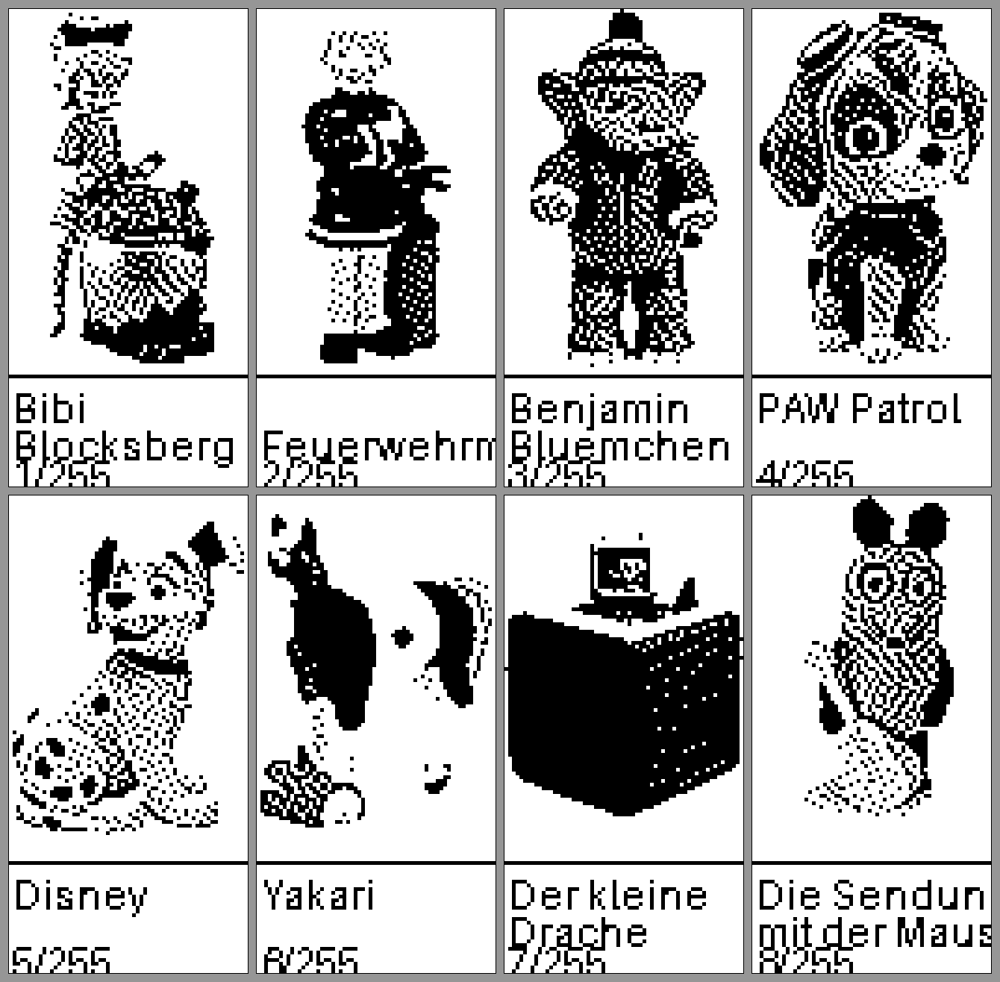
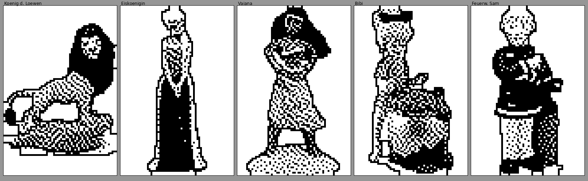

# OpenTonies · Flipper Zero

> **Kinderfreundliche Tonie-Auswahl im Hochformat — Figur aussuchen, aufs Kästchen legen, Toniebox spielt.**
> A kid-friendly Flipper Zero launcher that lets children pick a Tonie figure by its picture and emulates it (NXP ICODE SLIX-L) straight to the Toniebox.

<p align="center">
  
  &nbsp;&nbsp;&nbsp;
  
</p>

---

## Was ist das?

**OpenTonies** ist eine selbst entwickelte **Flipper-Zero-App** (in C, als `.fap`), die dem
Kind erlaubt, **Tonie-Figuren grafisch auszuwählen und direkt zu emulieren** — die
**Toniebox** erkennt die Figur und spielt sie ab.

Der Flipper wird **senkrecht** gehalten (64×128). Oben ein **großes Bild** der Figur,
darunter der Name. Zwei Ebenen: **Serie → Geschichte**. **OK** auf einer Geschichte
emuliert die SLIX-L-Figur, dann den Flipper einfach auf die Box legen. Während der
Emulation **blinkt die LED zyan** als klare Rückmeldung, dass gesendet wird.

Technischer Hintergrund: Die Toniebox liest Tonie-Figuren per NFC (NXP **ICODE SLIX-L**,
ISO 15693). Der Flipper Zero kann diese Tags lesen und emulieren. OpenTonies bündelt eine
ganze Sammlung eigener Figuren-Dumps mit aufbereiteten Bildern in einer Oberfläche, die
auch ein Vierjähriger bedienen kann.

## Für wen ist das?

- **Familien mit Toniebox + Flipper Zero**, die ihre **eigenen** Figuren an einem Ort
  bündeln wollen — z. B. um die (teils empfindlichen) Original-Figuren zu schonen, den
  Figuren-Berg zu ersetzen oder auf Reisen nur ein Gerät mitzunehmen.
- **Kinder**, die noch nicht lesen: Auswahl läuft über **Bilder**, nicht über Text.
- **Bastler & die Toniebox-Reverse-Engineering-Community**, die eine saubere,
  daten­getriebene Referenz-App für SLIX-L-Emulation auf **Momentum**-Firmware suchen.

> ⚠️ OpenTonies enthält **keine** fremden Inhalte. Es ist ein Werkzeug, mit dem du
> **deine eigenen** Tonies spiegelst. Siehe [Rechtliches](#rechtliches--disclaimer).

## Features

- 📱 **Hochformat-UI** (64×128) mit großem Figuren-Bild und Name.
- 🗂️ **Zwei Ebenen**: Serie → Geschichte, komplett bild­geführt.
- ⭐ **Favoriten**: Lieblingsserien landen ganz vorne (Toggle per **langem OK**), damit
  man nicht durch alle 255 Serien blättern muss.
- ⚡ **Direkte SLIX-L-Emulation** bei OK — exakt der Weg der eingebauten NFC-App
  (`NfcProtocolSlix`, `SlixTypeSlixL`).
- 💡 **LED-Blink** (zyan) während der Emulation als sichtbares „läuft"-Signal.
- 🖼️ **Kontur-Icons**: auch helle Figuren (König der Löwen, Elsa) bleiben klar erkennbar.
- 🔠 **Nur der Episodentitel** in Ebene 2 — der Serienname wird nicht wiederholt.
- ⚙️ **Verstecktes Setup** (langes Zurück, für Kinder nicht offensichtlich): Schrift
  **GROSS/klein** und ein **Lese-Modus ohne Bilder** (siehe unten).
- 🔌 **Datengetrieben**: keine fest eingebaute Figurenliste — alles wird zur Laufzeit von
  der SD gelesen. Neue Tonies erscheinen automatisch.

## Bedienung (Flipper senkrecht halten)

| Taste | Aktion |
|---|---|
| **← → / ↑ ↓** | vorige / nächste Serie bzw. Geschichte (alle Richtungen; **halten = schnell blättern**) |
| **OK** | Serie öffnen · Geschichte **abspielen** → Flipper auf die Box legen |
| **OK lang** (Serien-Ansicht) | Serie als **Favorit** ⭐ markieren / entfernen |
| **Zurück lang** (Serien-/Episoden-Ebene) | verstecktes **Setup** öffnen (nicht offensichtlich für Kinder) |
| **Zurück** | Emulation stoppen / eine Ebene zurück / App verlassen |

## Installation

Voraussetzung: Flipper Zero mit **Momentum**-Firmware.

```sh
# 1) Build-Umgebung (ufbt gegen Momentum-dev-SDK)
pip install --user ufbt
ufbt update --channel=dev --index-url=https://up.momentum-fw.dev/firmware/directory.json

# 2) App bauen + aufs Gerät
cd src && ufbt            # -> dist/toniekids.fap
ufbt launch              # installiert nach /ext/apps/NFC/ und startet
```

Danach im Menü **Apps → NFC → „OpenTonies"**.

## Wie es funktioniert (Architektur)

Die App hält **keine** eingebettete Figurenliste, sondern liest zur Laufzeit von der SD:

1. **Figuren/Struktur** — durchläuft `SD:/nfc/Toniebox Figuren/<Serie>/<Geschichte>.nfc`
   (Serie = Ordner, Geschichte = `.nfc`-Datei).
2. **Bilder** — lädt je Eintrag `SD:/apps_data/toniekids/icons_p/<Serie>/<Geschichte>.fxbm`
   (Serien-Übersicht: `_series.fxbm`). Format `.fxbm` = 2-Byte-Header `[Breite][Höhe]` +
   XBM-Bitmap (LSB-first, gesetztes Bit = schwarz), 64×96.
3. **Emulation** — bei OK: `nfc_device_load()` → `nfc_listener_start()` mit Protokoll
   `NfcProtocolSlix` (`SlixTypeSlixL`).
4. **Favoriten** — `SD:/apps_data/toniekids/favorites.txt` (eine Serie pro Zeile).

## Eigene Tonies hinzufügen

`.nfc`-Dump der **eigenen** Figur nach `SD:/nfc/Toniebox Figuren/<Serie>/` legen — fertig,
sie erscheint automatisch. Ein Bild ist optional (siehe Icon-Pipeline).

## Icon-Pipeline (Bilder erzeugen)

```sh
python3 tools/genicons.py --dry   # Match gegen tonies.json -> matches.json
python3 tools/gen4.py             # Zuschnitt + Maske + Kontur + Atkinson -> icons_p/ (64x96)
# hochladen:
python3 ~/.ufbt/current/scripts/storage.py -p /dev/ttyACM0 \
        send icons_p /ext/apps_data/toniekids/icons_p
```

`gen4.py` schneidet aufs Motiv zu, trennt es vom weißen Hintergrund, zieht eine **1-px-Kontur**
auf der Silhouette und dithert (Atkinson) — so bleiben auch helle Figuren erkennbar.

## Einstellungen (verstecktes Setup)

Das Setup ist bewusst **versteckt** (für Kinder nicht offensichtlich) — für Eltern aber in
zwei Sekunden erreichbar:

**So öffnest du es:**

1. Auf der **Serien-** oder **Geschichten-Ansicht** die **Zurück-Taste ca. 1 Sekunde
   gedrückt halten** (langer Druck) → es erscheint **SETUP**.
2. **↑ / ↓** wählt den Eintrag, **OK** schaltet ihn um, **Zurück** speichert & schließt.

**Was du einstellen kannst:**

| Eintrag | Optionen | Wirkung |
|---|---|---|
| **Schrift** | `GROSS` / `klein` | Namen komplett in Großbuchstaben oder normal. |
| **Bilder** | `AN` / `AUS` | `AUS` = **Lese-Modus**: nur der Titel (groß), damit das Kind *liest* statt am Bild abzulesen. |
| **LED** | `AN` / `AUS` | LED-Blink während der Emulation. |
| **LED-Farbe** | Zyan/Blau/Grün/Rot/Magenta/Gelb/Weiß | Farbe des Blinkens. |
| **Helligkeit** | niedrig / mittel / hoch | Helligkeit der LED. |
| **Auto-Timer** | Aus / 30 / 45 / 60 / 90 min | Beendet die Emulation nach Ablauf (Strom sparen). Nutzt die **echte Spieldauer** des Tonies, falls bekannt — sonst den eingestellten Wert als Fallback. |
| **Aktion** | `Aus` / `Replay` | Nach der Timer-Zeit: **Aus** = Emulation stoppen · **Replay** = kurz aus (5 s) & wieder an, um „neu aufstellen" zu simulieren (experimentell). |
| **Laufschrift** | Aus / langsam / mittel / schnell | Zu lange Namen **laufen horizontal durch** (statt abgeschnitten) — mit **einstellbarem Tempo**, damit das Kind auch komplette lange Titel lesen kann. |

Gespeichert in `SD:/apps_data/toniekids/settings.txt`; überlebt Neustarts. Standard:
Schrift **GROSS**, Bilder **an**, LED **an** (zyan/mittel), Auto-Timer **aus**.

**Echte Spieldauern:** Der Auto-Timer nutzt die Tabelle `tools/durations.txt`
(Zeilen `<Serie>/<Datei>.nfc` + Tab + `<Minuten>`), erzeugt mit **`tools/gen_durations.py`**
(gleicht die Sammlung über die tonies.com-**Sitemap** gegen die echten Produkt-URLs ab und
liest die Spieldauer). Zur Nutzung nach `SD:/apps_data/toniekids/durations.txt` kopieren.
Aktuell **~58 %** der (Standard-)Sammlung abgedeckt — der Rest steht meist gar nicht (mehr)
auf tonies.com; dafür greift der Fallback-Wert.

### 🙌 Mithelfen: die Spieldauer-Bibliothek erweitern

Die Tabelle deckt erst **~58 %** ab — **Beiträge sind willkommen!** So geht's:

1. Das Repo **forken** (oben rechts auf GitHub).
2. In `tools/durations.txt` Zeilen ergänzen oder korrigieren — je Zeile
   `<Serie>/<Datei>.nfc` + **Tab** + `<Minuten>`. (Oder `tools/gen_durations.py`
   verbessern und neu laufen lassen.)
3. Einen **Pull Request** öffnen.

> Direktes Pushen ist gesperrt — Beiträge laufen ausschließlich über **Fork + Pull Request**,
> und nur der Maintainer merged. So kann jede*r Spieldauern beisteuern, ohne am Code etwas
> ändern zu können.

## Roadmap

- 🌐 Höhere Abdeckung der Spieldauer-Tabelle (bessere Titel→tonies.com-Zuordnung).
- 🈳 Bild-Sprache umschaltbar (**DE / EN / FR**).
- 💭 **Laut gedacht — Web-App als Companion** (statt einer nativen App): eine Web-App,
  die auf **jedem Endgerät** läuft (Smartphone, Tablet, PC), ohne App-Store. Denkbar wären
  **visuelle Tonie-Auswahl** am großen Bildschirm, **Start/Stop** der Emulation und
  komfortable Sammlungs-/Favoritenverwaltung — so würde der Flipper-„Tonie" mit dem
  Smartphone als Companion ein Stück **smarter** 🙂.

  > Das ist vorerst **nur die Idee** — wird noch **nicht** aktiv entwickelt. Und bevor
  > überhaupt etwas online geht, machen wir unsere **Security-Hausaufgaben**. Lieber
  > sicher als schnell.

> Ideen, Wünsche oder Pull Requests sind willkommen — Issues gern aufmachen.

## Vollständig vibecoded — und das ist gut so 🎈

Volle Transparenz: OpenTonies ist **komplett „vibecoded"**. Die **Idee**, das Konzept, das
Hochformat, die Favoriten, die kindgerechte Bedienung — alles von **mir**. Den **Code** hat
eine KI geschrieben, Schritt für Schritt nach meiner Ansage.

Und das ist ausdrücklich **nichts Schlechtes** — im Gegenteil. **Vibecoding** macht das
Programmieren-Können optional: Wer eine gute Idee hat, aber (noch) nicht selbst coden kann,
war früher außen vor. Heute lässt sich genau diese Hürde überwinden. Aus „ich kann das
nicht bauen" wird „ich beschreibe, was ich will — und es entsteht". Für mich ist das ein
Weg, die **Barriere „nicht programmieren können" zu umgehen**; die Idee bleibt meine, das
Werkzeug hilft nur beim Umsetzen. OpenTonies ist der lebende Beweis, dass dabei etwas
Echtes und Nützliches herauskommt.

## Danke / auf den Schultern von Riesen

OpenTonies gäbe es nicht ohne die Vorarbeit dieser Projekte:

- **[nortakales/flipper-zero-tonies](https://github.com/nortakales/flipper-zero-tonies)**
  — Referenz & Ausgangspunkt für Tonie-SLIX-L-Dumps auf dem Flipper.
- **[toniebox-reverse-engineering](https://github.com/toniebox-reverse-engineering)**
  (RevvoX) — u. a.
  **[tonies-json](https://github.com/toniebox-reverse-engineering/tonies-json)** (offene
  Tonie-Datenbank, Bildquelle der Icon-Pipeline) und
  **[teddyCloud](https://github.com/toniebox-reverse-engineering/teddyCloud)**.
- **[Momentum Firmware](https://github.com/Next-Flip/Momentum-Firmware)** — die Firmware,
  gegen die gebaut wird ([momentum-fw.dev](https://momentum-fw.dev)).
- **[Flipper Zero](https://github.com/flipperdevices/flipperzero-firmware)** — das Gerät
  und sein NFC-Stack, dessen SLIX-Listener OpenTonies nutzt.

## Rechtliches / Disclaimer

Dieses Repository enthält **nur eigenen Code, Werkzeuge und Doku**. **Nicht** enthalten
(und nicht verteilt) sind:

- **Tonie-NFC-Dumps** (`*.nfc`, `Toniebox Figuren/`) — fremde Inhalte, nur referenziert.
- **Tonie-Produktbilder / abgeleitete Icons** (`icons_p/`, Bild-Cache) — urheberrechtlich
  geschützt.
- Die vollständige **`tonies.json`** — nur per URL referenziert.

„Tonie", „Toniebox" und die Figuren sind Marken bzw. urheberrechtlich geschütztes Material
der jeweiligen Rechteinhaber (Boxine GmbH). Dieses Projekt steht in **keiner** Verbindung
zu Boxine/tonies. Nutze OpenTonies ausschließlich mit **deinen eigenen** Figuren im Rahmen
der für dich geltenden Gesetze (Privatkopie/Interoperabilität).

## Lizenz

Eigener Code unter **MIT** — siehe [LICENSE](LICENSE). Die oben genannten Fremd-Inhalte
sind davon ausgenommen und verbleiben bei ihren Rechteinhabern.
